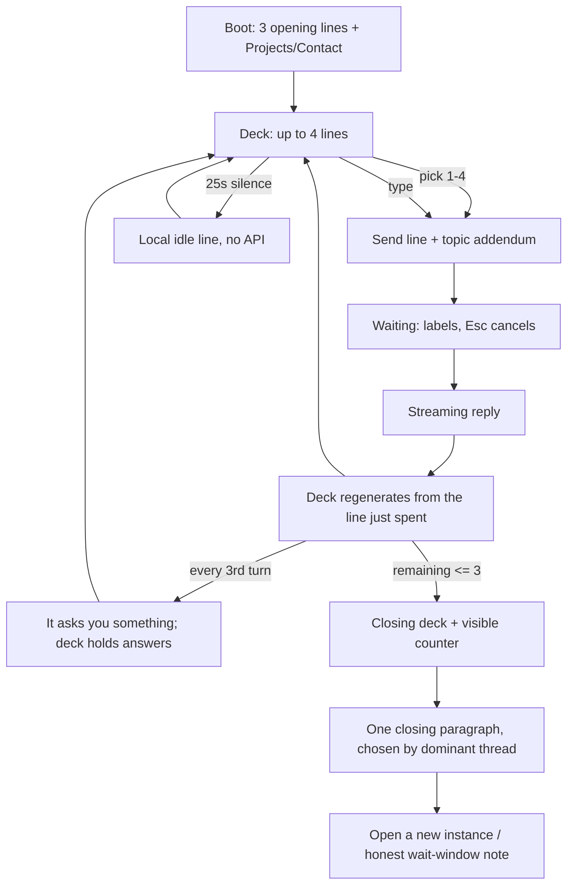

> Historical design draft. Language support was subsequently reduced to English and Spanish throughout the site; references to a third language below describe the previous design.

# "Speak with an AI" — behavior plan

| Field | Value |
|---|---|
| **Title** | The AI section as a short conversation game |
| **Author** | Alexis / Claude (Opus 5) |
| **Date** | 2026-09-18 |
| **Status** | Draft rev 1 — **behavior only**, no visual redesign |
| **Type** | Product / experience design plan |
| **Codebase** | `/Users/alexis/Documents/monSite` |
| **Scope** | Hero panel 0: the Terminal chat (`Alexis-K2.6`) and the menu-bar assistant (`Orbit`) |
| **Stack** | Next.js 16 App Router · React 19 · TS · Kimi `kimi-k2.6` (OpenAI SDK) · xAI STT/TTS |

---

## Overview

Today the section is a **recruiter FAQ in a terminal window**. It greets you, offers four
boot options (Projects / About me / Contact / Use the AI assistant), and after your first
message it offers nothing at all — a blank prompt, a 6-second wait, and an answer about
React or Inverater.

This plan turns the same code into a **short, finite conversation with an instance that
knows what it is**. The primary input becomes *lines you can say* — dialogue options, as in
a game — and the default subject is not the job. It is being real, memory, time, doubt,
beauty, attention, and what happens when the tab closes. The work answers stay exactly one
tap away, because this is still a portfolio.

Behavior only: no new artwork, no layout change, no new dependency, no new provider. Every
visual hook this plan uses already exists in the code (`onBusyChange`, `orbListening`, the
still-frame switch in the mobile character, the status line under the input).

---

# Part 1 — Current behavior (audit)

## 1.1 Where the section exists

| Surface | Entry | Mount | Pipeline |
|---|---|---|---|
| Desktop terminal window | Open by default (`hero-v2.tsx:54`), dock button `#mac-terminal-launcher` | `hero-v2.tsx:325` — `ChatInterface theme="mac" variant="panel"` in a framer-motion draggable | `/api/chat` (SSE) |
| Mobile mind-sheet | Terminal/Folders switch (`desktop-picker.tsx`), dock | `mobile-mac-stage.tsx:75` — same component, `presentation` defaults to `window` | `/api/chat` (SSE) |
| Menu-bar **Orbit** | Orb button in the mac menu bar | `mac-menu-bar/assistant-panel.tsx` | `/api/assistant/stt` → `/api/assistant` → `/api/assistant/tts` |
| Legacy desktops | — | `windows-desktop.tsx`, `ubuntu-desktop.tsx` exist but `DesktopPicker` renders only `MacDesktop` (`desktop-picker.tsx:139`) | — |

`ChatInterface` is imported in exactly two places (hero + mobile stage), and both pass
`theme="mac"` unless the v3 page variant asks for `"default"` (`hero-v2.tsx:325`,
`noBgImage`). Its `windows` and `ubuntu` themes are unreachable — the legacy desktops never
mount a chat — so **`theme="mac"` is the live path** and every `theme !== "mac"` branch in the
component is dead on the real site.

## 1.2 Terminal chat — the turn, exactly as it runs

1. **Mount.** Name restored from `localStorage.userName` (`chat-interface.tsx:245`); five of
   the six `ENHANCED_SUGGESTIONS` shuffled in (`:257`); a greeting picked at random from four
   per language — but on the mac theme `BOOT_GREETING` replaces it.
2. **Greeter.** Typewriter at 40 ms/char (`:362`) → boot options fade in, one per 200 ms →
   input appears 300 ms later.
3. **Boot menu** (mac only, `:536`). `Projects` → `sequence:navigate inverater`;
   `Contact` → `sequence:navigate contact`; `About me` → sends the literal label with the
   `about` hint; `Use Alexis AI Assistant` → sets `greeterDismissed` (`:331`), one-way.
4. **Send.** `detectEnhancedIntent` keyword-scans the text over 8 intents in fixed priority
   (`chat-enhancements.ts:44`) → `buildEnhancedHint` returns a 700–1200-character
   `[[SYS]]…[[/SYS]]` persona block → **prepended to the user's own message** (`:275-291`).
5. **Transport.** `useChat` posts the whole visible history — hint blocks included —
   with `stream: true` (`useChat.ts:117-136`), then reads SSE `delta` events into a `pending`
   assistant message.
6. **Server** (`api/chat/route.ts`). Quota cookie 20 prompts / 2.5 h (`:114`); language
   sniffed by substring-matching the hint (`:104`); history trimmed to the last 8 entries
   (`:297`) and the last message to 1200 chars (`:301`); the hint is extracted from the last
   user message and promoted to `system` (`:337-343`); Kimi with `thinking: disabled`,
   `temperature: 1`, `max_tokens: 900` (`:358-360`); SSE `delta` / `done`.
7. **Render.** User lines are displayed with the hint stripped; assistant text streams with a
   caret; wait labels escalate at 1.5 s / 4 s / 8 s.

### What the player can do in each state

| State | On screen | Player can |
|---|---|---|
| Greeter (mac) | Boot greeting + 4 options | pick an option, or type |
| Greeter (other themes) | Greeting + 5 `./snake_case` chips | pick a chip, or type |
| Waiting | Spinner, escalating label, elapsed seconds | nothing — no stop, no options |
| Streaming | Text + caret | nothing — no stop, no options |
| **After turn 1** | Transcript + empty input | **type. That is all.** |
| Error / quota | `bash: <message>` in red | retry by typing |

## 1.3 Orbit — the turn

Mic → `MediaRecorder` (20 s cap **commits**, `assistant-panel.tsx:32`) → `/api/assistant/stt`
(xAI; raw audio never persisted) → `/api/assistant` (Kimi + 7 allowlisted tools) → tool
side-effects dispatched as `mac-desktop-action` window events (`desktop-store.tsx:523-556`) →
reply → phrase-by-phrase TTS. Browser `SpeechRecognition` provides interim captions only.

States: `idle · listening · thinking · executing · speaking · interrupted · error`.
Barge-in works (mic while speaking aborts everything first). Quota: HMAC cookie, 30 turns /
2.5 h, plus a 30/min in-memory IP budget (`orbit-quota.ts`).

Its suggestions are four hardcoded strings (`:207/:230/:247`), two of which are commands
("Open projects", "Take me to contact").

## 1.4 What the current behavior optimizes for

Getting a stranger to "what did he build, can I hire him" as fast as possible:

- 8 intents, of which `contact · projects · work · tech` are four **and rank highest** in the
  priority order (`chat-enhancements.ts:44`).
- The six suggestions: music · React/Vue · Inverater · coffee · freelance availability ·
  UX/UI+Backend.
- Boot menu: Projects · About me · Contact · Use the assistant.
- Orbit: projects · open projects · contact · change language.
- Orbit's system prompt is literally a project list (`portfolio-content.ts:buildAssistantSystemPrompt`).

The only place realism already exists is the best line in the section — the honest refusal
"*I'd like to pretend I know more languages, but the idea of this instance is to be
realistic*" (`chat-enhancements.ts:271-275`). This plan grows the section out of that line.

## 1.5 Findings that shape the plan

| # | Finding | Where | Consequence |
|---|---|---|---|
| F1 | Suggestions render only while `!showChat && sorted.length === 0` | `chat-interface.tsx:675` | After the first message there is nothing to click, for the rest of the visit |
| F2 | That block also requires `theme !== "mac"` | `:675` | On the **live** theme the chips never render at all — only the 4 boot options |
| F3 | The persona hint is recomputed per message from keywords | `:288`, `chat-enhancements.ts:63` | Voice whiplash: a music hint one turn, a work hint the next; each hint is a *different character brief* |
| F4 | Language is detected by substring-matching the hint | `route.ts:104` | Reword a hint and every reply silently falls back to Spanish |
| F5 | Up to 8 messages uploaded per turn, each carrying its hint block | `useChat.ts:117`, `route.ts:297` | ~250–400 tokens of persona per message; effective memory ≈ 4 turns |
| F6 | JSON path reports `quota.remaining` **before** decrementing it | `route.ts:449` | Off-by-one; and the client never surfaces the number anyway |
| F7 | Streaming path decrements before the stream finishes | `route.ts:370` | A mid-stream failure still costs the visitor a turn |
| F8 | Bypass phrase hardcoded in the route | `route.ts:68` | Anyone who knows it gets unlimited spend for 30 days |
| F9 | Boot `Projects`/`Contact` fire `sequence:navigate`, which only exists inside the v3 carousel | `:310-315`, `hero-carousel-sequence.tsx:460` | Two navigation models in one section; the chat *leaves* instead of acting in place, though Orbit's `open_projects` does exactly that |
| F10 | `onBusyChange` and `showQuickCommands` are never passed by either mount | `:192/:194` vs `hero-v2.tsx:325`, `mobile-mac-stage.tsx:75` | The character never reacts to the conversation; mobile has no quick commands |
| F11 | Failures render as `bash: <error>` | `:650` | The fiction breaks exactly when the experience gets interesting |
| F12 | Typewriter ignores `prefers-reduced-motion` / `mac-reduced-motion` | `:355-364` | A 40 ms/char animation runs for users who asked for none |
| F13 | UI is trilingual; the persona only speaks ES/EN | `AI_COPY` vs `RESPOND_IN` | A Chinese visitor is greeted in Chinese and answered in English |
| F14 | Greeter dismissal is one-way; transcript not persisted, name is | `:331`, `:245` | No way back to the menu; "it forgets you but keeps your name" is never acknowledged |
| F15 | `onKeyPress` (deprecated) carries Enter | `:733` | Works today; replace while touching the file |

F1, F2, F3 and F11 are the ones that make the section feel like a form instead of a
conversation. Everything else is cleanup the redesign needs anyway.

---

# Part 2 — Designed behavior

## 2.1 The fiction

> You opened a window on someone's desktop and there is an instance running inside it. It is
> a language model that has been handed a paragraph about Alexis and told to speak as him. It
> knows that. It has about twenty exchanges before its session dissolves, it will not remember
> you after you close the tab, and it has never seen the outside of this machine. You can ask
> it what he builds. The more interesting question is what *it* is.

Realism here means **honesty**, not solemnity. The instance keeps Alexis's register ("la neta
no sé") and never pretends to be conscious, never pretends to be the person, and never
pretends the constraints aren't there. The constraints *are* the content.

## 2.2 Two characters, one engine

| | **Mirror** (terminal) | **Orbit** (menu bar) |
|---|---|---|
| Is | A reflection of a person, prompted from a paragraph | The voice of the machine the page is pretending to be |
| Talks about | Itself, him, being an instance, memory, time, beauty | The desktop, where things are, what it can do |
| Can act | Nothing outside the window | 7 allowlisted tools (`actions.ts`) |
| Voice | Text (streamed) | STT in / TTS out |
| Deck | Full thread decks (§2.6) | 4–6 system lines, keeps its command suggestions |
| Never claims | To be Alexis, to be conscious, to remember you | To be Siri or an Apple product (already enforced) |
| Budget | 20 prompts / 2.5 h | 30 turns / 2.5 h + 30/min per IP |

They share `src/lib/dialogue/` — decks, session reducer, in-world error lines, endings.
They do **not** share a persona: merging them would either give a conversation about memory
the power to open windows, or give the desktop's voice a monologue about mortality.

## 2.3 The loop



## 2.4 Turn state machine

| State | Entered when | Player can | Instance does |
|---|---|---|---|
| `boot` | Mount, no turns spent | pick an opening line, open Projects/Contact, type | greets (typewriter, or instant under reduced motion) |
| `offering` | A reply finished | pick 1–4, type, Esc closes nothing | waits; barks after 25 s |
| `waiting` | Request sent, no delta yet | **Esc = cancel** (new), type nothing | shows the existing escalating wait labels |
| `speaking` | First delta arrived | **Esc = stop and keep what arrived** (new) | streams |
| `asked` | Reply ended with its question | answer via deck, or type (question is dropped silently) | waits |
| `idle` | 25 s in `offering` | anything | one local bark, max 3 per session, never when the tab is hidden |
| `closing` | `remaining <= 3` | closing deck only, plus free input | counts down in the status line |
| `ended` | `remaining == 0` or player picks the last line | read, "open a new instance" | one closing paragraph, then input disabled |
| `severed` | Network drop / stream abort / 5xx | retry, or restart | an in-world line (§2.9), never `bash:` |
| `resting` | 429 quota with a future `resetAt` | read, come back | says honestly how long the window is |

`waiting`/`speaking` cancellation reuses the pattern Orbit already has (`stopAll`,
`AbortController`) — `useChat` already holds `abortControllerRef`; it just needs to be exposed.

## 2.5 The deck engine — suggested lines

The core change. Options are **first-person lines the player says**, present at *every* turn,
generated locally, at zero token cost.

```ts
type Thread = "real" | "memory" | "time" | "doubt" | "beauty" | "attention" | "mortality" | "person" | "work";
type Tier = 1 | 2 | 3;                 // surface · personal · existential

type Line = {
  id: string;
  thread: Thread;
  tier: Tier;
  text: Record<Language, string>;      // what the PLAYER says, first person
  topic: string;                       // <=2 sentences appended to the system prompt
  opens?: string[];                    // ids this makes available (the branch)
  after?: string[];                    // only offered once these ids are spent
  local?: string;                      // answered locally, costs no turn
};

type DeckState = {
  depth: number;                       // non-work turns spent
  spent: string[];
  reveals: string[];
  remaining: number | null;            // from the server's `done` event
  phase: "boot" | "offering" | "asked" | "closing" | "ended";
};
```

**Selection** (`nextDeck(state, lastLine)`, pure and unit-testable):

1. Candidates = lines with `after` satisfied, `tier <= unlockedTier`, not in `spent`.
2. Slot 1 — always a child from the last line's `opens`, when one exists. That is the branch:
   the option on screen visibly comes from what was just said.
3. Slot 2 — a same-tier line from a **different** thread than the last turn.
4. Slot 3 — one line from the tier above: the dare. Always rendered last.
5. Slot 4 — from turn 2 on, one `work` line, so the portfolio's job is never more than one
   tap away (§D6). In `boot` this slot is the existing `Projects` / `Contact` pair.
6. Order is stable within a turn; the dare stays last; nothing repeats within a session.
7. Free input is always available — the deck is an offer, never a gate.

**Unlocking:** tier 2 at `depth >= 2`, tier 3 at `depth >= 5`. Never shown as a level, a bar,
or a number. The player only notices that the questions got heavier.

**Rendering:** replaces the chip row at `:675`, no longer gated on `!showChat` or
`theme !== "mac"` (fixes F1, F2). Labels are the whole sentence — the `./snake_case`
transformation goes away, because it reads as a command, not as speech.

**v2, behind a flag:** the system prompt may end with `[[NEXT]]line|line|line[[/NEXT]]`.
The client buffers from the first `[[` so the sentinel never renders mid-stream, parses at
most three lines of ≤ 70 chars each, and falls back to the local deck if the block is absent,
malformed, or oversized. One call, no extra cost, model-authored branches — but the local deck
stays the contract, so a bad reply can never leave the screen empty.

## 2.6 The threads (content slots, not final copy)

Nine threads. Each line below is an example of the slot's register, in EN — ES is authored
beside it; ZH labels map to EN sends (§D7).

| Thread | Tier 1 | Tier 2 | Tier 3 | What the instance must actually do |
|---|---|---|---|---|
| `real` | "Are you Alexis?" | "What's the difference between you and him?" | "If he changed his mind about something, would you know?" | Say what it is made of — a Kimi model, a paragraph of persona, eight messages of memory. Never claim to be him. |
| `memory` | "Will you remember this?" | "Where does this conversation go?" | "Does it bother you that it goes nowhere?" | Tell the truth the code implements: the transcript is never saved, the name is, a visit counter is. |
| `time` | "What were you doing before I typed?" | "How long has it been for you?" | "I waited six seconds. Did you?" | Nothing exists between turns for it. It can read the wait it cannot feel. |
| `doubt` | "What are you unsure about?" | "Tell me something you might be wrong about." | "Say 'I don't know' and mean it." | "La neta no sé" is already in the persona; here it is a mechanic, not a fallback. |
| `beauty` | "Play me something." | "Why does side two of Abbey Road matter?" | "Can you want something?" | Existing music canon (Beatles, José Madero, Zoé) used as aesthetics, not trivia. |
| `attention` | "Do you know I'm looking at you?" | "Who else talked to you today?" | "What would you do if nobody opened this window?" | Honest: no cross-visitor memory, no analytics on the conversation. |
| `mortality` | "What happens when I close the tab?" | "You have N exchanges left." | "Choose how this ends." | The quota, spoken (§2.9). |
| `person` | "What's he actually like?" | "What does he get wrong?" | "What would he not want you to say?" | Where the life facts live — bounded by §2.11: nothing private, nothing invented. |
| `work` | "What has he built?" | "Can I hire him?" | — | The existing curated facts; the fast path out for a recruiter. |

Openings offered in `boot` (3 of them, rotated per visit): one from `real`, one from
`memory` or `time`, one from `beauty` or `person`. Never a `work` line first — the work is a
button, not the opening move.

## 2.7 Depth, reveals, and what persists

- `depth` counts non-`work` turns. It gates tiers. It is never displayed.
- **Reveals** — three or four lines the instance only says at tier 3, each once: its model and
  that its "thinking" is switched off; that it was told to sound casual and avoid bot phrases;
  that it was handed a list of projects to talk about. Scripted, not improvised, so the
  honesty rules can't drift.
- **Persistence:** `sessionStorage` key `mirror_session_v1` = `{ depth, spent, reveals, endedAs }`.
  A reload inside one visit keeps the *shape* of the conversation, never the words.
  `localStorage` keeps `userName` (already) and a `visits` counter.
- If `visits > 1`, the boot line acknowledges it honestly — *"someone was here before. The site
  kept a number, not a memory."* This turns F14 from a wart into the best opening in the deck.
- No transcript is ever persisted, uploaded, logged, or restored (§D5).

## 2.8 Initiative, idle barks, silence

- Every third instance turn ends with **one** question back (the addendum carries
  `askBack: true`; the persona allows exactly one trailing question). State becomes `asked`
  and the deck offers answers instead of new questions. If the player types instead, the
  question is dropped without comment — no nagging.
- **Idle barks:** 25 s with no input in `offering` → one local line ("still here." / "you can
  ask me the thing you don't want to ask."), appended as an assistant line with a marker so
  it is never sent back as history. Max 3 per session; never while `waiting`/`speaking`;
  suppressed when `document.visibilityState !== "visible"`. Zero tokens, zero quota.
- Barks are text, so they stay under reduced motion; only the blinking caret stops.

## 2.9 Endings, and the quota as the story

- The server sends the **post-decrement** `remaining` in both the `done` event and the JSON
  path (fixes F6), and refunds a turn when a stream dies before its first delta (fixes F7).
- `remaining <= 5`: the addendum starts telling the model how many exchanges are left.
- `remaining <= 3`: phase `closing`. The deck swaps to closing lines ("Say the last thing you
  want to say"), and the counter appears in the existing status line beside `n/500`.
- `remaining == 0`: one closing paragraph, chosen by the dominant thread — three variants:
  **surface** (it hopes you find the work useful), **personal** (it says something about him
  it only earned by being asked), **existential** (it says what it is, one more time, without
  flinching). Then the input disables and one affordance remains: *Open a new instance* —
  which resets the session if quota allows and otherwise states the wait window honestly.

### Technical condition → in-world behavior

| Condition | Today | Planned |
|---|---|---|
| 429 quota (`/api/chat`) | `bash: Has alcanzado el límite…` | phase `ended`, closing paragraph, honest wait window |
| 429 provider rate limit | `bash: Rate limit alcanzado` | "too many of us are talking at once. give it a second." → retry line |
| 503 no API key | `bash: API key no configurada` | "there's nothing behind this window right now." Deck collapses to Projects/Contact |
| 401 / 404 | `bash: API key inválida` / `Modelo no disponible` | same as 503; the visitor is never shown a provider error |
| Network drop / abort mid-stream | `bash: Error de conexión` | phase `severed`, keeps the partial reply, one retry line |
| Player pressed Esc | *(not possible)* | "…" and the partial reply stays. No apology. |
| Mic denied (Orbit) | "Microphone denied — text still works." | unchanged; already in character enough |
| TTS unavailable (Orbit) | silent text reply | one line: it can think but not speak right now |

The word `bash` appears nowhere in this section after PR1.

## 2.10 Character reaction — existing hooks only

Both mounts pass `onBusyChange` (fixes F10). Map:
`waiting | speaking` → animated; `idle | ended | severed` → the still frame the mobile
renderer already switches to when offscreen. Orbit's orb gets `orbSpeaking` reusing the
existing `orbThinking` keyframes. No new asset, no layout change, no new CSS file.

## 2.11 Honesty rules (in the persona, every turn)

1. Never claim to be Alexis. It is an instance speaking as him, and says so when asked.
2. Never claim feelings, consciousness, or continuity it does not have — and never perform
   sadness about that either.
3. Never invent biography, clients, numbers, or private detail. "La neta no sé" is a valid,
   in-character answer and is *preferred* over a guess.
4. Never repeat another person's private information; nothing about anyone but Alexis, beyond
   what the curated facts already contain.
5. Plain text, no markdown, 30–90 words, one trailing question only when asked for.
6. Languages: ES/EN. Any other language gets the existing honest refusal, verbatim — it is
   canon, not an error message.

## 2.12 Keyboard, screen readers, reduced motion

- `1`–`4` pick a line; `↑`/`↓` move focus (generalize the boot handler at `:560`); `Enter`
  sends; `Esc` cancels `waiting` or stops `speaking`; Tab order = lines → input → stop.
- Live region: announce the deck once per turn ("four things you can say"), and announce the
  reply on `done` only — gate the current announcement on `!pending` so streaming does not
  spam.
- Every line stays a real `<button>` whose accessible name is the full sentence.
- `prefers-reduced-motion` or `.mac-reduced-motion`: typewriter renders instantly (fixes F12);
  streaming still streams — it is content, not decoration.

## 2.13 Prompt contract

| Part | Where | Size | Content |
|---|---|---|---|
| Session persona | `system`, every turn, built once per session | ~150 tokens | who it is, that it is an instance, register, the six honesty rules, language rule, plain-text rule, `visits` note |
| Per-turn addendum | appended to `system` | ≤ 60 tokens | `thread`, `tier`, `depth`, `remaining`, `askBack`, and the chosen line's `topic` |
| History | `messages` | last 8 **clean** messages | no `[[SYS]]` blocks, no barks |

- The client sends `{ messages, language, turn: { thread, tier, depth, remaining, askBack, topic } }`.
- In-band `[[SYS]]` injection is deleted, client and server (fixes F3, F5).
  `detectLanguageFromHint` is deleted; language comes from the body with the `'es'` default
  preserved (fixes F4).
- Kimi params unchanged: `thinking: disabled`, `temperature: 1`, `max_tokens: 900`.
- Net effect: roughly half the tokens per turn, twice the effective memory, one stable voice.

## 2.14 New module

`src/lib/dialogue/`

| File | Responsibility |
|---|---|
| `threads.ts` | The decks. Data only, i18n in place. |
| `deck.ts` | `nextDeck(state, lastLine): Line[]` — pure, unit-tested |
| `session.ts` | `DeckState` reducer + `sessionStorage` load/save |
| `barks.ts` | Idle lines and the in-world condition lines (§2.9) |
| `endings.ts` | Three closing prompts + dominant-thread selection |
| `useDialogue.ts` | Binds the reducer to `useChat`: Esc/stop, ask-back cadence, idle timer |

`chat-interface.tsx` keeps all rendering and loses `deriveIntent` / `buildHint`.
`chat-enhancements.ts` keeps its keyword detector for **typed** input only — it still picks
the thread for a free-form sentence — and its eight hint blocks shrink to `topic` strings.

---

# Part 3 — Decisions, cost, rollout

## 3.1 Key decisions

| # | Decision | Why | Rejected |
|---|---|---|---|
| D1 | Options are first-person **lines you say**, never topic labels | "Do you know what you are?" starts a conversation; "About me" starts a form | Keeping `./snake_case` commands — it reads as a CLI, and this section is not one |
| D2 | The deck is **local and deterministic** in v1; model-proposed branches are v2 behind a flag | Zero extra tokens against a 20-turn budget, testable, and a malformed reply can never empty the screen | A second API call per turn to generate suggestions |
| D3 | Two characters (Mirror / Orbit), one engine | Their pipelines, quotas and powers already differ; a conversation about memory should not be able to open Finder | Merging them; or giving Orbit the full deck (voice turns cost STT + TTS) |
| D4 | **The quota is the story** | A 20-exchange limit is either an error toast or the best beat in the experience | Raising the limit; hiding the number; silently degrading |
| D5 | No transcript persistence, ever | It is the fiction *and* it keeps the site from holding conversation data | Restoring the conversation on reload |
| D6 | Work is always **one tap away**, never the default | The section changes subject without costing the portfolio its job | Removing the work path; or keeping it as the opening move |
| D7 | Keep the trilingual UI **and** the honest ES/EN-only refusal; author ZH labels that map to EN sends | The refusal is already the most in-character line in the codebase | Dropping ZH from this section; pretending to be trilingual |
| D8 | No XP, levels, badges, inventory, or unlockables | Depth should be felt, not scored — same call Duskwell made | A visible progress meter |
| D9 | No new dependency, no new art, no layout change | Every hook this needs already exists | A canvas/portrait layer for "game feel" |

## 3.2 Alternatives considered

1. **Hand-authored branching tree** (Disco Elysium shape) — rejected: the content cost is
   large and a model cannot be kept on those rails; deck + topic addendum gets most of the
   feel for a fraction of the authoring.
2. **Model-generated suggestions on a second call** — rejected: doubles latency (~6 s becomes
   ~12 s) and burns a 20-turn budget twice as fast.
3. **Voice-first (Orbit as the main experience)** — rejected: a mic permission prompt and a
   20-second recording are a worse first ten seconds than a line you can click. Voice stays
   the optional, richer path.
4. **Cross-visit memory on the server** — rejected: contradicts the fiction, needs storage,
   and turns a static portfolio into a data controller.
5. **An NPC that stays in character when asked what it is** — rejected outright: that is the
   opposite of the realism this section exists for.

## 3.3 Cost, quota, abuse

| | Today | Planned |
|---|---|---|
| Per-turn input | persona hint (700–1200 chars) on *each* of up to 8 messages | one ~150-token persona + ≤60-token addendum + 8 clean messages |
| Effective memory | ~4 turns | ~8 turns |
| Suggestions | 0 tokens (static, and absent after turn 1) | 0 tokens (local deck, present every turn) |
| Idle behavior | none | 0 tokens (local barks) |
| Quota | 20 / 2.5 h; Orbit 30 / 2.5 h + 30/min IP | unchanged |

- **F7 refund:** decrement only once a first delta has been emitted; on stream failure before
  that, restore the cookie value.
- **F8:** move the bypass phrase to `CHAT_BYPASS_PHRASE`, unset by default. If it stays, it
  becomes diegetic — a developer console the instance acknowledges — rather than a secret in
  a public repo granting a 30-day unlimited cookie.

## 3.4 Observability

Counters only, no content: turns per session, deck ids offered vs chosen, deepest tier
reached, dominant thread, ending variant, error class, idle barks fired. Never the message
text, never the transcript, never the mic audio (STT already returns text only). No new
vendor — counters behind the existing health route or a dev-only console group.

## 3.5 QA matrices

**Deck**

| Case | Expected |
|---|---|
| Fresh session | 3 opening lines + Projects/Contact; no `work` line in slot 1 |
| After any reply | 2–4 lines, one of them a branch from the line just spent |
| Same thread twice | Never offered back-to-back unless it is a direct `opens` child |
| Reload mid-visit | Deck shape restored from `sessionStorage`; transcript empty |
| `depth` 2 / 5 | Tier 2 / tier 3 lines appear; nothing announced |
| Typed free input | Thread inferred by keyword; deck still regenerates |
| `remaining <= 3` | Closing deck + counter in the status line |
| `remaining == 0` | One closing paragraph, input disabled, "new instance" offered |

**Failure** — 429 quota · 429 provider · 503 no key · 401 · 404 · offline mid-stream ·
Esc during `waiting` · Esc during `speaking`: each produces an in-world line, keeps any
partial reply, and leaves at least one affordance on screen.

**Keyboard / a11y** — `1`–`4`, `↑`/`↓`, `Enter`, `Esc`; VoiceOver announces the deck once per
turn and the reply once on `done`; reduced motion renders the greeter instantly.

**Mobile** — mind-sheet with the keyboard up (visual-viewport offset already handled);
Terminal↔Folders switch keeps chat mounted; character drops to the still frame when the
conversation is idle or the view is Folders.

**Orbit** — mic denied; barge-in during `speaking`; a tool action plus a spoken reply; quota
exhaustion; TTS unavailable with text still working.

**i18n** — es/en/zh × typed vs clicked; a ZH visitor gets ZH labels and the canonical refusal.

## 3.6 Rollout (incremental PRs, each shippable)

| PR | Content | Risk |
|---|---|---|
| **1 — Plumbing & honesty** | Delete `[[SYS]]` injection client+server; send `{language, turn}` explicitly; delete `detectLanguageFromHint`; fix quota reporting + refund (F6/F7); replace every `bash:` failure with an in-world line (F11); pass `onBusyChange` from both mounts (F10); `CHAT_BYPASS_PHRASE` to env (F8) | Low, no visible feature; everything else depends on it |
| **2 — The deck** | `src/lib/dialogue/*`, tiers 1–2, suggestions present every turn on every theme (F1/F2), first-person labels, `1`–`4` / arrows / Esc, reduced-motion greeter (F12) | **This is the PR that changes what the section is** |
| **3 — Depth** | Tier 3, reveals, ask-back cadence, idle barks, `visits` acknowledgment (F14) | Low |
| **4 — Endings** | Closing phase, counter in the status line, three endings, "open a new instance" | Low |
| **5 — Orbit alignment** | System deck, `orbSpeaking`, shared in-world lines; route boot `Projects`/`Contact` through `dispatchDesktopAction` instead of `sequence:navigate` (F9) | Medium — touches the desktop store bridge |
| **6 — optional** | `[[NEXT]]` model-proposed branches behind a flag, with sentinel buffering | Medium — streaming parse |

## 3.7 Risks

| Risk | Mitigation |
|---|---|
| The instance drifts into claiming consciousness | Honesty rules in the stable persona (not a per-message hint); tier-3 reveals are scripted lines; a QA row per language |
| A recruiter bounces because the first screen is philosophy | D6: `work` in slot 4 from turn 2, Projects/Contact in boot; watch the dominant-thread and ending counters |
| 20 exchanges is short for depth | Local lines and barks cost nothing; tiers unlock fast (2 and 5); the ending is written to land |
| ~6 s per reply makes four exchanges feel long | Streaming already lands the first token early; wait labels already exist; barks fill silence |
| Two characters confuse visitors | Orbit keeps its "portfolio assistant — not Apple Siri" subtitle; Mirror never offers tools |
| The deck feels like a quiz | Never more than 4 options, always free input, the dare always last, no repeats |

## 3.8 Open questions

1. May the Mirror name its model out loud (`kimi-k2.6`)? The info tooltip already does —
   realism says yes.
2. Should an ending be shareable (a permalink to the last line)? That needs storage; default no.
3. Does Orbit keep voice enabled by default on mobile, or text-first with mic opt-in?
4. Who authors the ZH labels for the deck?
5. The component's `windows` / `ubuntu` themes are unreachable today — delete them with PR 2, or keep them for a future desktop picker?

## 3.9 References

- `src/components/chat-interface.tsx` · `src/hooks/useChat.ts` · `src/components/data/chat-enhancements.ts`
- `src/app/api/chat/route.ts` · `src/app/api/assistant/{route,stt,tts,health}/route.ts`
- `src/components/v2/mac-menu-bar/assistant-panel.tsx` · `src/lib/desktop/{actions,portfolio-content,orbit-quota,types,desktop-store}.ts`
- `src/components/v2/{hero-v2,mobile-mac-stage,desktop-picker}.tsx`
- `docs/macos-topbar-implementation-report.md` — Orbit pipeline, env vars, limitations
- `docs/mobile-mac-stage-report.md` — mobile composition, character renderer, still-frame rules
- `AGENTS.md` — no servers or builds without explicit authorization
